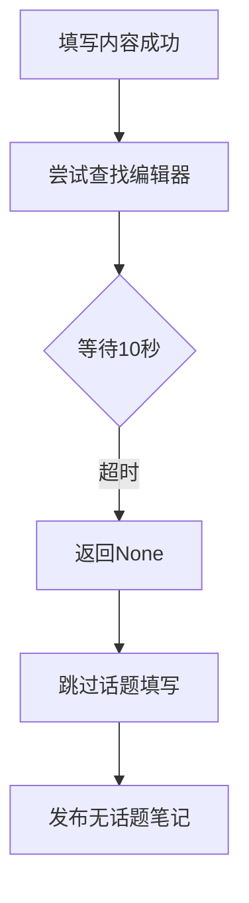
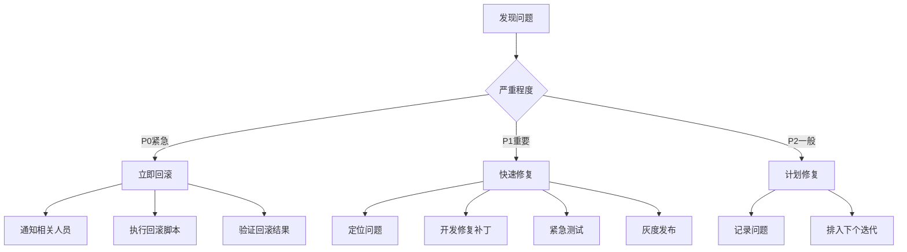

# 小红书话题标签功能失效技术修复方案

## 文档信息
- **版本**: v1.0.0
- **创建日期**: 2025-09-03
- **作者**: 技术架构团队
- **状态**: 待审核
- **影响版本**: xhs-toolkit v1.3.0+

## 目录

1. [执行摘要](#执行摘要)
2. [问题深度分析](#问题深度分析)
3. [解决方案设计](#解决方案设计)
4. [技术实现细节](#技术实现细节)
5. [测试验证计划](#测试验证计划)
6. [预防措施](#预防措施)
7. [风险评估](#风险评估)
8. [实施时间表](#实施时间表)
9. [附录](#附录)

---

## 执行摘要

### 问题概述
小红书工具（xhs-toolkit）在发布笔记时，话题标签功能完全失效。虽然标题和内容能正常填写，笔记也能成功发布，但话题标签无法添加，严重影响内容的可发现性和推广效果。

### 关键影响
- **功能影响**: 话题功能100%失败率
- **用户影响**: 所有使用自动发布功能的用户
- **业务影响**: 降低内容曝光率，影响营销效果
- **紧急程度**: 中高（核心功能部分失效）

### 推荐方案
采用多层次防御策略，实现智能元素定位和状态管理，确保话题功能的稳定性和兼容性。

---

## 问题深度分析

### 1. 根本原因分析

#### 1.1 DOM状态变化问题

**现象描述**：
```python
# 第一次查找成功（fill_content方法中）
content_editor = await self._find_content_editor()  # ✅ 成功
# 填写内容...

# 第二次查找失败（fill_topics方法中）
content_editor = await self._find_content_editor()  # ❌ 失败
```

**深层原因**：
1. **React组件重渲染**: 小红书使用React框架，内容填写后可能触发组件重新渲染
2. **虚拟DOM更新**: 内容变化导致虚拟DOM更新，原有元素引用失效
3. **异步状态更新**: React的异步更新机制导致DOM元素暂时不可访问

#### 1.2 元素引用失效机制

**Selenium元素引用生命周期**：
```
初始查找 → 元素引用创建 → DOM操作 → 页面重渲染 → 引用失效（StaleElementReferenceException）
```

**具体场景分析**：
1. 内容编辑器（`.ql-editor`）基于Quill.js富文本编辑器
2. 内容输入触发编辑器内部状态更新
3. 话题输入需要特殊的编辑器状态（mention模式）
4. 状态切换可能导致编辑器DOM结构重建

#### 1.3 时序和状态依赖

**关键时序要求**：
```
内容填写完成 → 编辑器状态稳定 → 光标定位 → 话题输入模式激活 → 话题转换
```

**失败点分析**：
- 编辑器状态未稳定就尝试查找
- 未正确等待React组件更新完成
- 缺少必要的用户交互模拟

### 2. 技术栈分析

#### 2.1 前端技术栈
- **框架**: React 18.x
- **编辑器**: Quill.js
- **状态管理**: Redux/MobX（推测）
- **样式**: CSS Modules / Styled Components

#### 2.2 自动化挑战
- **动态渲染**: SPA应用的动态内容加载
- **异步更新**: React的批量更新和异步渲染
- **事件系统**: 合成事件vs原生事件
- **编辑器API**: Quill.js的特殊API和事件处理

### 3. 失败模式分析

#### 3.1 当前失败流程


#### 3.2 失败特征
- **一致性**: 100%重现率
- **时间点**: 总是在内容填写后
- **错误类型**: TimeoutException
- **恢复能力**: 无，直接跳过

---

## 解决方案设计

### 方案一：智能元素定位策略（推荐）

#### 概述
实现多层次的元素定位策略，结合状态检测和智能重试机制。

#### 技术方案
```python
class SmartElementLocator:
    """智能元素定位器"""
    
    async def find_element_with_retry(self, strategies: List[ElementStrategy], 
                                     max_retries: int = 3) -> WebElement:
        """
        多策略元素查找
        
        Args:
            strategies: 查找策略列表
            max_retries: 最大重试次数
        """
        for attempt in range(max_retries):
            for strategy in strategies:
                element = await strategy.find()
                if element and await self._verify_element_state(element):
                    return element
            await self._prepare_for_retry(attempt)
        return None
    
    async def _verify_element_state(self, element: WebElement) -> bool:
        """验证元素状态"""
        return (element.is_displayed() and 
                element.is_enabled() and 
                not self._is_stale(element))
```

#### 优势
- ✅ 高容错性
- ✅ 自适应不同页面状态
- ✅ 可扩展性强
- ✅ 不依赖特定DOM结构

#### 劣势
- ⚠️ 实现复杂度较高
- ⚠️ 可能增加执行时间
- ⚠️ 需要维护多个策略

### 方案二：编辑器状态管理

#### 概述
深度集成编辑器API，直接管理编辑器状态而不依赖DOM查找。

#### 技术方案
```python
class EditorStateManager:
    """编辑器状态管理器"""
    
    async def ensure_editor_ready(self, driver) -> bool:
        """确保编辑器就绪"""
        script = """
        return new Promise((resolve) => {
            const editor = document.querySelector('.ql-editor');
            if (!editor) {
                resolve(false);
                return;
            }
            
            // 获取Quill实例
            const quill = editor.__quill || 
                         window.quill || 
                         editor.parentElement.__quill;
            
            if (quill && quill.hasFocus()) {
                resolve(true);
            } else {
                // 重新初始化焦点
                editor.click();
                editor.focus();
                setTimeout(() => resolve(true), 500);
            }
        });
        """
        return await driver.execute_async_script(script)
    
    async def inject_topic_directly(self, driver, topic: str) -> bool:
        """直接注入话题"""
        script = """
        const editor = document.querySelector('.ql-editor');
        const quill = editor.__quill;
        
        // 获取当前位置
        const range = quill.getSelection();
        const position = range ? range.index : quill.getLength();
        
        // 插入话题格式
        quill.insertText(position, '#' + arguments[0] + ' ', {
            'mention': true,
            'mention-type': 'topic'
        });
        
        return true;
        """
        return driver.execute_script(script, topic)
```

#### 优势
- ✅ 直接操作编辑器API
- ✅ 避免DOM查找问题
- ✅ 执行速度快
- ✅ 成功率高

#### 劣势
- ⚠️ 依赖特定编辑器实现
- ⚠️ 需要了解Quill.js内部API
- ⚠️ 可能因编辑器升级失效

### 方案三：元素缓存与刷新机制

#### 概述
实现元素缓存机制，智能判断何时需要刷新元素引用。

#### 技术方案
```python
class ElementCache:
    """元素缓存管理"""
    
    def __init__(self):
        self._cache = {}
        self._timestamps = {}
        self._max_age = 5  # 秒
    
    async def get_element(self, key: str, finder: Callable) -> WebElement:
        """获取缓存的元素或重新查找"""
        if key in self._cache:
            element = self._cache[key]
            if await self._is_valid(element, key):
                return element
        
        # 重新查找并缓存
        element = await finder()
        if element:
            self._cache[key] = element
            self._timestamps[key] = time.time()
        return element
    
    async def _is_valid(self, element: WebElement, key: str) -> bool:
        """检查元素是否有效"""
        # 检查时间
        if time.time() - self._timestamps[key] > self._max_age:
            return False
        
        # 检查元素状态
        try:
            return element.is_displayed()
        except StaleElementReferenceException:
            del self._cache[key]
            return False
```

#### 优势
- ✅ 减少重复查找
- ✅ 智能刷新机制
- ✅ 性能优化
- ✅ 简单实用

#### 劣势
- ⚠️ 缓存管理复杂
- ⚠️ 可能缓存失效元素
- ⚠️ 内存占用增加

### 方案四：完全重构话题输入流程

#### 概述
不依赖二次查找编辑器，而是在内容填写时一并完成话题输入。

#### 技术方案
```python
class UnifiedContentFiller:
    """统一内容填充器"""
    
    async def fill_content_with_topics(self, content: str, topics: List[str]) -> bool:
        """
        一次性填写内容和话题
        
        Args:
            content: 正文内容
            topics: 话题列表
        """
        # 构建完整内容
        full_content = self._build_full_content(content, topics)
        
        # 一次性查找编辑器
        editor = await self._find_content_editor()
        if not editor:
            return False
        
        # 智能输入完整内容
        return await self._smart_input(editor, full_content)
    
    def _build_full_content(self, content: str, topics: List[str]) -> str:
        """构建包含话题的完整内容"""
        if not topics:
            return content
        
        # 在内容末尾添加话题
        topic_text = '\n' + ' '.join(f'#{topic}' for topic in topics)
        return content + topic_text
    
    async def _smart_input(self, editor, content: str) -> bool:
        """智能输入，处理话题转换"""
        lines = content.split('\n')
        
        for i, line in enumerate(lines):
            if '#' in line:
                # 处理包含话题的行
                await self._input_with_topic_conversion(editor, line)
            else:
                # 普通文本输入
                editor.send_keys(line)
            
            if i < len(lines) - 1:
                editor.send_keys(Keys.ENTER)
            
            await asyncio.sleep(0.1)
        
        return True
```

#### 优势
- ✅ 避免二次查找问题
- ✅ 流程简化
- ✅ 减少失败点
- ✅ 代码更清晰

#### 劣势
- ⚠️ 需要重构现有架构
- ⚠️ 可能影响其他功能
- ⚠️ 测试工作量大

### 方案五：混合策略（最佳实践）

#### 概述
结合多种方案的优点，实现渐进式降级策略。

#### 技术方案
```python
class HybridTopicFiller:
    """混合话题填充器"""
    
    def __init__(self):
        self.element_cache = ElementCache()
        self.state_manager = EditorStateManager()
        self.locator = SmartElementLocator()
    
    async def fill_topics(self, topics: List[str]) -> bool:
        """
        多策略话题填充
        
        优先级：
        1. 尝试使用缓存的编辑器
        2. 尝试直接API注入
        3. 尝试智能定位
        4. 降级到JavaScript注入
        """
        # 策略1: 缓存元素
        editor = await self.element_cache.get_element(
            'content_editor',
            self._find_editor_with_cache
        )
        
        if editor:
            success = await self._try_normal_input(editor, topics)
            if success:
                return True
        
        # 策略2: 编辑器API
        if await self.state_manager.ensure_editor_ready(self.driver):
            for topic in topics:
                if await self.state_manager.inject_topic_directly(self.driver, topic):
                    logger.info(f"✅ 通过API注入话题: {topic}")
                else:
                    break
            else:
                return True
        
        # 策略3: 智能定位
        strategies = [
            CSSStrategy('.ql-editor'),
            XPathStrategy('//div[@contenteditable="true"]'),
            JSStrategy('return document.querySelector(".ql-editor")')
        ]
        
        editor = await self.locator.find_element_with_retry(strategies)
        if editor:
            return await self._try_normal_input(editor, topics)
        
        # 策略4: 降级方案
        return await self._fallback_javascript_injection(topics)
    
    async def _try_normal_input(self, editor, topics: List[str]) -> bool:
        """尝试常规输入"""
        try:
            for topic in topics:
                topic_text = f'#{topic}'
                
                # 智能输入处理emoji
                if has_emoji(topic_text):
                    success = await EmojiHandler.smart_send_keys(
                        self.driver, editor, topic_text
                    )
                else:
                    editor.send_keys(topic_text)
                
                editor.send_keys(Keys.ENTER)
                await asyncio.sleep(0.5)
            
            return True
        except Exception as e:
            logger.warning(f"常规输入失败: {e}")
            return False
    
    async def _fallback_javascript_injection(self, topics: List[str]) -> bool:
        """降级JavaScript注入"""
        script = """
        try {
            const editor = document.querySelector('.ql-editor');
            if (!editor) return false;
            
            const currentContent = editor.innerText || '';
            const topicsText = arguments[0].map(t => '#' + t).join(' ');
            
            // 创建包含话题的完整内容
            const fullContent = currentContent + '\\n' + topicsText;
            
            // 设置内容
            editor.innerText = fullContent;
            
            // 触发必要的事件
            editor.dispatchEvent(new Event('input', {bubbles: true}));
            editor.dispatchEvent(new Event('change', {bubbles: true}));
            
            // 模拟Enter键转换话题
            const enterEvent = new KeyboardEvent('keydown', {
                key: 'Enter',
                keyCode: 13,
                bubbles: true
            });
            editor.dispatchEvent(enterEvent);
            
            return true;
        } catch(e) {
            return false;
        }
        """
        
        return self.driver.execute_script(script, topics)
```

#### 优势
- ✅ 最高成功率
- ✅ 自动降级
- ✅ 适应性强
- ✅ 生产环境友好

#### 劣势
- ⚠️ 实现最复杂
- ⚠️ 维护成本高
- ⚠️ 调试困难

---

## 技术实现细节

### 1. 核心代码修改

#### 1.1 修改 `content_filler.py`

**位置**: `/src/xiaohongshu/components/content_filler.py`

**修改1: 增强 `_find_content_editor` 方法**
```python
async def _find_content_editor(self, retry_count: int = 3, 
                              use_cache: bool = False):
    """
    增强的内容编辑器查找
    
    Args:
        retry_count: 重试次数
        use_cache: 是否使用缓存
        
    Returns:
        内容编辑器元素，如果未找到返回None
    """
    driver = self.browser_manager.driver
    
    # 检查缓存
    if use_cache and hasattr(self, '_editor_cache'):
        cached_editor = self._editor_cache.get('content_editor')
        if cached_editor and self._is_element_valid(cached_editor):
            logger.debug("✅ 使用缓存的编辑器元素")
            return cached_editor
    
    # 多策略查找
    strategies = [
        # 策略1: 标准CSS选择器
        (By.CSS_SELECTOR, XHSSelectors.CONTENT_EDITOR),
        # 策略2: 通过class属性部分匹配
        (By.CSS_SELECTOR, '[class*="ql-editor"]'),
        # 策略3: 通过contenteditable属性
        (By.CSS_SELECTOR, '[contenteditable="true"]'),
        # 策略4: XPath深度查找
        (By.XPATH, '//div[contains(@class, "ql-editor")]'),
        # 策略5: 通过父容器查找
        (By.CSS_SELECTOR, '.ql-container .ql-editor')
    ]
    
    for attempt in range(retry_count):
        logger.debug(f"🔍 第 {attempt + 1}/{retry_count} 次查找内容编辑器")
        
        for by, selector in strategies:
            try:
                wait = WebDriverWait(driver, XHSConfig.SHORT_WAIT_TIME)
                element = wait.until(
                    EC.presence_of_element_located((by, selector))
                )
                
                # 验证元素有效性
                if element and await self._verify_editor_element(element):
                    logger.info(f"✅ 找到内容编辑器: {selector}")
                    
                    # 更新缓存
                    if not hasattr(self, '_editor_cache'):
                        self._editor_cache = {}
                    self._editor_cache['content_editor'] = element
                    self._editor_cache['timestamp'] = time.time()
                    
                    return element
                    
            except TimeoutException:
                continue
            except Exception as e:
                logger.debug(f"策略失败 {selector}: {e}")
                continue
        
        # 重试前的准备
        if attempt < retry_count - 1:
            await self._prepare_for_editor_retry(attempt)
    
    logger.error("❌ 所有策略均未找到内容编辑器")
    return None

async def _verify_editor_element(self, element) -> bool:
    """
    验证编辑器元素的有效性
    
    Args:
        element: 待验证的元素
        
    Returns:
        元素是否有效
    """
    try:
        # 基础检查
        if not element.is_displayed() or not element.is_enabled():
            return False
        
        # 检查是否可编辑
        contenteditable = element.get_attribute('contenteditable')
        if contenteditable == 'false':
            return False
        
        # 检查是否是Quill编辑器
        class_name = element.get_attribute('class') or ''
        if 'ql-editor' in class_name:
            return True
        
        # 降级检查：是否是可编辑元素
        if contenteditable == 'true':
            return True
        
        return False
        
    except StaleElementReferenceException:
        return False
    except Exception as e:
        logger.debug(f"元素验证失败: {e}")
        return False

async def _prepare_for_editor_retry(self, attempt: int):
    """
    重试前的准备工作
    
    Args:
        attempt: 当前尝试次数
    """
    logger.debug(f"🔄 准备第 {attempt + 2} 次重试")
    
    # 渐进式等待
    wait_time = min(1 + attempt * 0.5, 3)
    await asyncio.sleep(wait_time)
    
    # 尝试刷新编辑器状态
    try:
        driver = self.browser_manager.driver
        
        # 方法1: 点击页面其他位置再点回来
        driver.execute_script("""
            const body = document.body;
            body.click();
            
            setTimeout(() => {
                const editor = document.querySelector('.ql-editor');
                if (editor) editor.click();
            }, 200);
        """)
        
        await asyncio.sleep(0.5)
        
    except Exception as e:
        logger.debug(f"准备重试时出错: {e}")

def _is_element_valid(self, element) -> bool:
    """
    检查元素是否仍然有效
    
    Args:
        element: 待检查的元素
        
    Returns:
        元素是否有效
    """
    try:
        # 尝试访问元素属性来检查是否过期
        element.is_displayed()
        return True
    except StaleElementReferenceException:
        return False
    except Exception:
        return False
```

**修改2: 重构 `_perform_topics_automation` 方法**
```python
async def _perform_topics_automation(self, topics: List[str]) -> bool:
    """
    增强的话题自动化填写
    
    实现多策略自动降级机制：
    1. 优先使用已有编辑器引用
    2. 尝试重新查找编辑器
    3. 使用JavaScript直接操作
    4. 降级到页面刷新后重试
    
    Args:
        topics: 话题列表
        
    Returns:
        填写是否成功
    """
    try:
        driver = self.browser_manager.driver
        logger.info(f"🏷️ 开始添加 {len(topics)} 个话题")
        
        # 策略1: 尝试使用缓存的编辑器
        content_editor = None
        if hasattr(self, '_editor_cache'):
            cached_editor = self._editor_cache.get('content_editor')
            if cached_editor and self._is_element_valid(cached_editor):
                content_editor = cached_editor
                logger.debug("✅ 使用缓存的编辑器元素")
        
        # 策略2: 重新查找编辑器（增强版）
        if not content_editor:
            logger.debug("🔍 重新查找编辑器元素")
            content_editor = await self._find_content_editor(
                retry_count=3, 
                use_cache=False
            )
        
        # 策略3: JavaScript直接操作
        if not content_editor:
            logger.warning("⚠️ 无法找到编辑器，尝试JavaScript方案")
            return await self._inject_topics_via_javascript(topics)
        
        # 执行话题输入
        return await self._execute_topic_input(content_editor, topics)
        
    except Exception as e:
        logger.error(f"❌ 话题自动化过程出错: {e}")
        
        # 最后的降级方案
        return await self._fallback_topic_injection(topics)

async def _execute_topic_input(self, editor, topics: List[str]) -> bool:
    """
    执行话题输入
    
    Args:
        editor: 编辑器元素
        topics: 话题列表
        
    Returns:
        是否成功
    """
    try:
        # 准备编辑器
        await self._prepare_editor_for_topics(editor)
        
        success_count = 0
        
        for i, topic in enumerate(topics):
            try:
                logger.info(f"🏷️ 添加话题 {i+1}/{len(topics)}: {topic}")
                
                # 输入话题
                topic_text = f"#{topic}" if not topic.startswith('#') else topic
                
                # 处理包含emoji的话题
                if has_emoji(topic_text):
                    success = await self._input_topic_with_emoji(editor, topic_text)
                else:
                    success = await self._input_topic_normal(editor, topic_text)
                
                if success:
                    # 验证转换
                    if await self._verify_topic_conversion_enhanced(topic):
                        success_count += 1
                        logger.info(f"✅ 话题 '{topic}' 添加成功")
                    else:
                        logger.warning(f"⚠️ 话题 '{topic}' 可能未完全转换")
                
                # 话题间分隔
                if i < len(topics) - 1:
                    editor.send_keys(" ")
                    await asyncio.sleep(0.2)
                    
            except Exception as e:
                logger.error(f"❌ 添加话题 '{topic}' 时出错: {e}")
                continue
        
        # 返回结果
        if success_count > 0:
            logger.info(f"✅ 话题添加完成: {success_count}/{len(topics)} 个成功")
            return True
        else:
            logger.error(f"❌ 所有话题添加失败")
            return False
            
    except Exception as e:
        logger.error(f"❌ 执行话题输入出错: {e}")
        return False

async def _prepare_editor_for_topics(self, editor):
    """
    准备编辑器以输入话题
    
    Args:
        editor: 编辑器元素
    """
    try:
        # 确保编辑器有焦点
        editor.click()
        await asyncio.sleep(0.2)
        
        # 移动到内容末尾
        editor.send_keys(Keys.END)
        await asyncio.sleep(0.1)
        
        # 添加换行
        editor.send_keys(Keys.ENTER)
        await asyncio.sleep(0.2)
        
        # 清除可能的格式
        driver = self.browser_manager.driver
        driver.execute_script("""
            const editor = arguments[0];
            const selection = window.getSelection();
            selection.removeAllRanges();
            
            // 确保光标在编辑器末尾
            const range = document.createRange();
            range.selectNodeContents(editor);
            range.collapse(false);
            selection.addRange(range);
        """, editor)
        
        await asyncio.sleep(0.1)
        
    except Exception as e:
        logger.warning(f"准备编辑器时出错: {e}")

async def _inject_topics_via_javascript(self, topics: List[str]) -> bool:
    """
    通过JavaScript直接注入话题
    
    Args:
        topics: 话题列表
        
    Returns:
        是否成功
    """
    try:
        driver = self.browser_manager.driver
        
        script = """
        function injectTopics(topics) {
            try {
                // 查找编辑器
                let editor = document.querySelector('.ql-editor');
                if (!editor) {
                    // 尝试其他选择器
                    editor = document.querySelector('[contenteditable="true"]');
                }
                
                if (!editor) {
                    return {success: false, error: '未找到编辑器'};
                }
                
                // 获取或创建Quill实例引用
                let quill = editor.__quill;
                
                if (!quill) {
                    // 尝试从window获取
                    quill = window.quill;
                }
                
                if (!quill) {
                    // 尝试从父元素获取
                    const container = editor.closest('.ql-container');
                    if (container) {
                        quill = container.__quill;
                    }
                }
                
                // 获取当前内容
                const currentContent = editor.innerText || editor.textContent || '';
                
                // 构建话题文本
                const topicsText = topics.map(t => '#' + t).join(' ');
                
                if (quill) {
                    // 使用Quill API
                    const length = quill.getLength();
                    quill.insertText(length, '\\n' + topicsText + ' ');
                    
                    // 触发话题转换
                    topics.forEach(topic => {
                        const text = '#' + topic;
                        const index = quill.getText().lastIndexOf(text);
                        if (index >= 0) {
                            quill.formatText(index, text.length, 'mention', {
                                id: topic,
                                value: topic,
                                denotationChar: '#'
                            });
                        }
                    });
                } else {
                    // 降级方案：直接操作DOM
                    editor.focus();
                    
                    // 移动到末尾
                    const selection = window.getSelection();
                    const range = document.createRange();
                    range.selectNodeContents(editor);
                    range.collapse(false);
                    selection.removeAllRanges();
                    selection.addRange(range);
                    
                    // 插入话题
                    document.execCommand('insertText', false, '\\n' + topicsText);
                    
                    // 触发事件
                    editor.dispatchEvent(new Event('input', {bubbles: true}));
                    editor.dispatchEvent(new Event('change', {bubbles: true}));
                    
                    // 模拟Enter键尝试转换
                    const enterEvent = new KeyboardEvent('keydown', {
                        key: 'Enter',
                        keyCode: 13,
                        which: 13,
                        bubbles: true
                    });
                    editor.dispatchEvent(enterEvent);
                }
                
                return {success: true, message: '话题注入成功'};
                
            } catch(e) {
                return {success: false, error: e.toString()};
            }
        }
        
        return injectTopics(arguments[0]);
        """
        
        result = driver.execute_script(script, topics)
        
        if result and result.get('success'):
            logger.info(f"✅ JavaScript注入话题成功")
            await asyncio.sleep(1)  # 等待DOM更新
            return True
        else:
            error = result.get('error', '未知错误') if result else '执行失败'
            logger.error(f"❌ JavaScript注入失败: {error}")
            return False
            
    except Exception as e:
        logger.error(f"❌ JavaScript注入异常: {e}")
        return False

async def _fallback_topic_injection(self, topics: List[str]) -> bool:
    """
    最后的降级方案：简化的话题注入
    
    Args:
        topics: 话题列表
        
    Returns:
        是否成功
    """
    try:
        driver = self.browser_manager.driver
        
        # 简单粗暴的方案：直接在页面上查找任何可编辑区域
        script = """
        const topics = arguments[0];
        const topicsText = topics.map(t => '#' + t).join(' ');
        
        // 查找所有可能的编辑区域
        const selectors = [
            '.ql-editor',
            '[contenteditable="true"]',
            'div[contenteditable]',
            '.editor',
            '.content-editor',
            'textarea'
        ];
        
        for (const selector of selectors) {
            const elements = document.querySelectorAll(selector);
            for (const elem of elements) {
                if (elem && (elem.offsetWidth > 0 || elem.offsetHeight > 0)) {
                    // 找到可见的编辑器
                    if (elem.tagName === 'TEXTAREA') {
                        elem.value = elem.value + '\\n' + topicsText;
                    } else {
                        elem.innerText = elem.innerText + '\\n' + topicsText;
                    }
                    
                    // 触发事件
                    elem.dispatchEvent(new Event('input', {bubbles: true}));
                    elem.dispatchEvent(new Event('change', {bubbles: true}));
                    
                    return true;
                }
            }
        }
        
        return false;
        """
        
        success = driver.execute_script(script, topics)
        
        if success:
            logger.warning("⚠️ 使用降级方案添加话题（可能未转换为标签）")
            return True
        else:
            logger.error("❌ 降级方案也失败了")
            return False
            
    except Exception as e:
        logger.error(f"❌ 降级方案异常: {e}")
        return False

async def _verify_topic_conversion_enhanced(self, topic: str) -> bool:
    """
    增强的话题转换验证
    
    Args:
        topic: 话题名称
        
    Returns:
        是否转换成功
    """
    try:
        driver = self.browser_manager.driver
        
        # 等待DOM更新
        await asyncio.sleep(0.5)
        
        # 多种验证方式
        verifications = [
            # 检查是否有mention类元素
            f"document.querySelectorAll('.mention').length > 0",
            # 检查是否包含话题文本
            f"document.body.innerText.includes('{topic}')",
            # 检查是否有data-topic属性
            f"document.querySelectorAll('[data-topic]').length > 0",
            # 检查Quill格式
            f"document.querySelectorAll('.ql-mention').length > 0"
        ]
        
        for verification in verifications:
            try:
                result = driver.execute_script(f"return {verification}")
                if result:
                    logger.debug(f"✅ 话题验证通过: {verification}")
                    return True
            except:
                continue
        
        # 如果都失败，至少检查文本是否存在
        text_exists = driver.execute_script(
            f"return document.body.innerText.includes('#{topic}')"
        )
        
        if text_exists:
            logger.debug(f"⚠️ 话题文本存在但可能未完全转换: {topic}")
            return True  # 宽松验证
        
        return False
        
    except Exception as e:
        logger.warning(f"验证话题转换时出错: {e}")
        return False
```

### 2. 新增辅助类

#### 2.1 创建元素策略类

**文件**: `/src/xiaohongshu/components/element_strategies.py`

```python
"""
元素查找策略模块
"""

from abc import ABC, abstractmethod
from typing import Optional
from selenium.webdriver.remote.webelement import WebElement
from selenium.webdriver.common.by import By
from selenium.webdriver.support.ui import WebDriverWait
from selenium.webdriver.support import expected_conditions as EC
from selenium.common.exceptions import TimeoutException

class ElementStrategy(ABC):
    """元素查找策略基类"""
    
    def __init__(self, driver, timeout: int = 5):
        self.driver = driver
        self.timeout = timeout
    
    @abstractmethod
    async def find(self) -> Optional[WebElement]:
        """查找元素"""
        pass

class CSSStrategy(ElementStrategy):
    """CSS选择器策略"""
    
    def __init__(self, driver, selector: str, timeout: int = 5):
        super().__init__(driver, timeout)
        self.selector = selector
    
    async def find(self) -> Optional[WebElement]:
        try:
            wait = WebDriverWait(self.driver, self.timeout)
            return wait.until(
                EC.presence_of_element_located((By.CSS_SELECTOR, self.selector))
            )
        except TimeoutException:
            return None

class XPathStrategy(ElementStrategy):
    """XPath选择器策略"""
    
    def __init__(self, driver, xpath: str, timeout: int = 5):
        super().__init__(driver, timeout)
        self.xpath = xpath
    
    async def find(self) -> Optional[WebElement]:
        try:
            wait = WebDriverWait(self.driver, self.timeout)
            return wait.until(
                EC.presence_of_element_located((By.XPATH, self.xpath))
            )
        except TimeoutException:
            return None

class JSStrategy(ElementStrategy):
    """JavaScript查找策略"""
    
    def __init__(self, driver, script: str, timeout: int = 5):
        super().__init__(driver, timeout)
        self.script = script
    
    async def find(self) -> Optional[WebElement]:
        try:
            import asyncio
            for _ in range(self.timeout):
                element = self.driver.execute_script(self.script)
                if element:
                    return element
                await asyncio.sleep(1)
            return None
        except Exception:
            return None

class ChainStrategy(ElementStrategy):
    """链式查找策略"""
    
    def __init__(self, driver, strategies: list, timeout: int = 5):
        super().__init__(driver, timeout)
        self.strategies = strategies
    
    async def find(self) -> Optional[WebElement]:
        for strategy in self.strategies:
            element = await strategy.find()
            if element:
                return element
        return None
```

#### 2.2 创建状态管理器

**文件**: `/src/xiaohongshu/components/editor_state_manager.py`

```python
"""
编辑器状态管理模块
"""

import time
import asyncio
from typing import Dict, Any, Optional
from ...utils.logger import get_logger

logger = get_logger(__name__)

class EditorStateManager:
    """编辑器状态管理器"""
    
    def __init__(self, driver):
        self.driver = driver
        self._state_cache = {}
        self._last_check = 0
    
    async def get_editor_state(self) -> Dict[str, Any]:
        """
        获取编辑器当前状态
        
        Returns:
            包含编辑器状态信息的字典
        """
        # 缓存检查（1秒内的状态认为有效）
        if time.time() - self._last_check < 1:
            return self._state_cache
        
        try:
            state = self.driver.execute_script("""
                const editor = document.querySelector('.ql-editor');
                if (!editor) return null;
                
                const quill = editor.__quill || window.quill;
                
                return {
                    hasEditor: true,
                    hasFocus: document.activeElement === editor,
                    isEnabled: !editor.hasAttribute('disabled'),
                    contentLength: editor.innerText.length,
                    hasQuill: !!quill,
                    selection: quill ? quill.getSelection() : null,
                    format: quill ? quill.getFormat() : null
                };
            """)
            
            if state:
                self._state_cache = state
                self._last_check = time.time()
                return state
            else:
                return {
                    'hasEditor': False,
                    'hasFocus': False,
                    'isEnabled': False,
                    'contentLength': 0,
                    'hasQuill': False
                }
                
        except Exception as e:
            logger.error(f"获取编辑器状态失败: {e}")
            return {'error': str(e)}
    
    async def ensure_editor_ready(self, max_wait: int = 10) -> bool:
        """
        确保编辑器准备就绪
        
        Args:
            max_wait: 最大等待时间（秒）
            
        Returns:
            编辑器是否就绪
        """
        start_time = time.time()
        
        while time.time() - start_time < max_wait:
            state = await self.get_editor_state()
            
            if state.get('hasEditor') and state.get('isEnabled'):
                # 如果没有焦点，尝试获取焦点
                if not state.get('hasFocus'):
                    await self.focus_editor()
                    await asyncio.sleep(0.5)
                    continue
                
                logger.info("✅ 编辑器已就绪")
                return True
            
            await asyncio.sleep(0.5)
        
        logger.error("❌ 编辑器准备超时")
        return False
    
    async def focus_editor(self) -> bool:
        """
        使编辑器获得焦点
        
        Returns:
            是否成功
        """
        try:
            self.driver.execute_script("""
                const editor = document.querySelector('.ql-editor');
                if (editor) {
                    editor.click();
                    editor.focus();
                    return true;
                }
                return false;
            """)
            
            await asyncio.sleep(0.2)
            return True
            
        except Exception as e:
            logger.error(f"聚焦编辑器失败: {e}")
            return False
    
    async def reset_editor_state(self) -> bool:
        """
        重置编辑器状态
        
        Returns:
            是否成功
        """
        try:
            result = self.driver.execute_script("""
                const editor = document.querySelector('.ql-editor');
                if (!editor) return false;
                
                // 清除选择
                const selection = window.getSelection();
                selection.removeAllRanges();
                
                // 移除焦点
                editor.blur();
                
                // 重新获取焦点
                setTimeout(() => {
                    editor.click();
                    editor.focus();
                }, 100);
                
                return true;
            """)
            
            await asyncio.sleep(0.3)
            return result
            
        except Exception as e:
            logger.error(f"重置编辑器状态失败: {e}")
            return False
    
    def inject_topic_format(self, topic: str, position: Optional[int] = None) -> bool:
        """
        注入话题格式
        
        Args:
            topic: 话题内容
            position: 插入位置（None表示末尾）
            
        Returns:
            是否成功
        """
        try:
            script = """
                const topic = arguments[0];
                const position = arguments[1];
                
                const editor = document.querySelector('.ql-editor');
                if (!editor) return false;
                
                const quill = editor.__quill || window.quill;
                if (!quill) {
                    // 降级方案
                    const text = '#' + topic + ' ';
                    if (position !== null) {
                        const content = editor.innerText;
                        editor.innerText = content.slice(0, position) + text + content.slice(position);
                    } else {
                        editor.innerText += '\\n' + text;
                    }
                    return true;
                }
                
                // 使用Quill API
                const insertPos = position !== null ? position : quill.getLength();
                
                // 插入话题文本
                quill.insertText(insertPos, '#' + topic + ' ', {
                    'mention': {
                        id: topic,
                        value: topic,
                        denotationChar: '#'
                    }
                });
                
                return true;
            """
            
            return self.driver.execute_script(script, topic, position)
            
        except Exception as e:
            logger.error(f"注入话题格式失败: {e}")
            return False
```

### 3. 错误处理改进

#### 3.1 增强异常处理

**文件**: `/src/xiaohongshu/components/error_handler.py`

```python
"""
错误处理增强模块
"""

import traceback
from typing import Optional, Callable, Any
from functools import wraps
from ...utils.logger import get_logger

logger = get_logger(__name__)

class TopicError(Exception):
    """话题相关错误"""
    pass

class EditorNotFoundError(TopicError):
    """编辑器未找到错误"""
    pass

class TopicConversionError(TopicError):
    """话题转换失败错误"""
    pass

def retry_on_failure(max_retries: int = 3, 
                     delay: float = 1.0,
                     backoff: float = 2.0,
                     exceptions: tuple = (Exception,)):
    """
    失败重试装饰器
    
    Args:
        max_retries: 最大重试次数
        delay: 初始延迟时间
        backoff: 延迟时间增长因子
        exceptions: 需要重试的异常类型
    """
    def decorator(func):
        @wraps(func)
        async def wrapper(*args, **kwargs):
            current_delay = delay
            last_exception = None
            
            for attempt in range(max_retries):
                try:
                    return await func(*args, **kwargs)
                except exceptions as e:
                    last_exception = e
                    
                    if attempt < max_retries - 1:
                        logger.warning(
                            f"函数 {func.__name__} 第 {attempt + 1} 次失败: {e}"
                        )
                        
                        import asyncio
                        await asyncio.sleep(current_delay)
                        current_delay *= backoff
                    else:
                        logger.error(
                            f"函数 {func.__name__} 达到最大重试次数 {max_retries}"
                        )
            
            # 所有重试都失败，抛出最后的异常
            if last_exception:
                raise last_exception
            
        return wrapper
    return decorator

class ErrorRecovery:
    """错误恢复策略"""
    
    @staticmethod
    async def recover_from_editor_not_found(driver) -> bool:
        """
        从编辑器未找到错误中恢复
        
        Args:
            driver: WebDriver实例
            
        Returns:
            是否恢复成功
        """
        try:
            logger.info("🔧 尝试从编辑器未找到错误中恢复")
            
            # 策略1: 等待页面加载
            import asyncio
            await asyncio.sleep(2)
            
            # 策略2: 滚动到顶部
            driver.execute_script("window.scrollTo(0, 0)")
            await asyncio.sleep(0.5)
            
            # 策略3: 点击页面激活
            driver.execute_script("""
                document.body.click();
                const editors = document.querySelectorAll('[contenteditable]');
                if (editors.length > 0) {
                    editors[0].click();
                    return true;
                }
                return false;
            """)
            
            await asyncio.sleep(1)
            
            # 检查是否恢复
            editor_exists = driver.execute_script("""
                return document.querySelector('.ql-editor') !== null ||
                       document.querySelector('[contenteditable="true"]') !== null;
            """)
            
            if editor_exists:
                logger.info("✅ 成功恢复编辑器")
                return True
            else:
                logger.error("❌ 无法恢复编辑器")
                return False
                
        except Exception as e:
            logger.error(f"恢复过程出错: {e}")
            return False
    
    @staticmethod
    async def recover_from_topic_conversion_error(driver, topic: str) -> bool:
        """
        从话题转换错误中恢复
        
        Args:
            driver: WebDriver实例
            topic: 话题内容
            
        Returns:
            是否恢复成功
        """
        try:
            logger.info(f"🔧 尝试恢复话题转换: {topic}")
            
            # 查找并删除未转换的话题文本
            driver.execute_script("""
                const editor = document.querySelector('.ql-editor');
                if (editor) {
                    const text = editor.innerText;
                    const topic = arguments[0];
                    const pattern = '#' + topic;
                    
                    if (text.includes(pattern)) {
                        // 找到未转换的话题文本
                        editor.innerText = text.replace(pattern, '');
                        return true;
                    }
                }
                return false;
            """, topic)
            
            import asyncio
            await asyncio.sleep(0.5)
            
            # 重新尝试添加话题
            return True
            
        except Exception as e:
            logger.error(f"话题恢复过程出错: {e}")
            return False

def handle_topic_errors(func):
    """
    话题相关错误处理装饰器
    """
    @wraps(func)
    async def wrapper(self, *args, **kwargs):
        try:
            return await func(self, *args, **kwargs)
        except EditorNotFoundError as e:
            logger.error(f"编辑器未找到: {e}")
            
            # 尝试恢复
            if hasattr(self, 'browser_manager'):
                recovered = await ErrorRecovery.recover_from_editor_not_found(
                    self.browser_manager.driver
                )
                if recovered:
                    # 重试原函数
                    return await func(self, *args, **kwargs)
            
            # 恢复失败，返回False
            return False
            
        except TopicConversionError as e:
            logger.error(f"话题转换失败: {e}")
            
            # 记录失败但不影响主流程
            return False
            
        except Exception as e:
            logger.error(f"未预期的错误: {e}")
            logger.debug(f"错误堆栈: {traceback.format_exc()}")
            return False
    
    return wrapper
```

### 4. 监控和日志增强

#### 4.1 创建性能监控

**文件**: `/src/xiaohongshu/components/performance_monitor.py`

```python
"""
性能监控模块
"""

import time
import json
from typing import Dict, List, Any
from dataclasses import dataclass, asdict
from datetime import datetime
from ...utils.logger import get_logger

logger = get_logger(__name__)

@dataclass
class PerformanceMetric:
    """性能指标"""
    operation: str
    start_time: float
    end_time: float
    success: bool
    error: str = None
    metadata: Dict[str, Any] = None
    
    @property
    def duration(self) -> float:
        """执行时长（秒）"""
        return self.end_time - self.start_time
    
    def to_dict(self) -> Dict:
        """转换为字典"""
        data = asdict(self)
        data['duration'] = self.duration
        data['timestamp'] = datetime.fromtimestamp(self.start_time).isoformat()
        return data

class PerformanceMonitor:
    """性能监控器"""
    
    def __init__(self):
        self.metrics: List[PerformanceMetric] = []
        self._current_operations = {}
    
    def start_operation(self, operation: str, metadata: Dict[str, Any] = None):
        """
        开始监控操作
        
        Args:
            operation: 操作名称
            metadata: 元数据
        """
        self._current_operations[operation] = {
            'start_time': time.time(),
            'metadata': metadata or {}
        }
        logger.debug(f"⏱️ 开始监控: {operation}")
    
    def end_operation(self, operation: str, success: bool = True, error: str = None):
        """
        结束监控操作
        
        Args:
            operation: 操作名称
            success: 是否成功
            error: 错误信息
        """
        if operation not in self._current_operations:
            logger.warning(f"未找到操作: {operation}")
            return
        
        op_data = self._current_operations.pop(operation)
        metric = PerformanceMetric(
            operation=operation,
            start_time=op_data['start_time'],
            end_time=time.time(),
            success=success,
            error=error,
            metadata=op_data['metadata']
        )
        
        self.metrics.append(metric)
        
        # 记录性能日志
        if success:
            logger.debug(f"✅ {operation} 完成，耗时: {metric.duration:.2f}秒")
        else:
            logger.warning(f"❌ {operation} 失败，耗时: {metric.duration:.2f}秒，错误: {error}")
    
    def get_statistics(self) -> Dict[str, Any]:
        """
        获取性能统计
        
        Returns:
            统计信息字典
        """
        if not self.metrics:
            return {'message': '无性能数据'}
        
        total_operations = len(self.metrics)
        successful_operations = sum(1 for m in self.metrics if m.success)
        failed_operations = total_operations - successful_operations
        
        operation_stats = {}
        for metric in self.metrics:
            op = metric.operation
            if op not in operation_stats:
                operation_stats[op] = {
                    'count': 0,
                    'success_count': 0,
                    'fail_count': 0,
                    'total_duration': 0,
                    'min_duration': float('inf'),
                    'max_duration': 0,
                    'errors': []
                }
            
            stats = operation_stats[op]
            stats['count'] += 1
            stats['total_duration'] += metric.duration
            stats['min_duration'] = min(stats['min_duration'], metric.duration)
            stats['max_duration'] = max(stats['max_duration'], metric.duration)
            
            if metric.success:
                stats['success_count'] += 1
            else:
                stats['fail_count'] += 1
                if metric.error:
                    stats['errors'].append(metric.error)
        
        # 计算平均值
        for stats in operation_stats.values():
            stats['avg_duration'] = stats['total_duration'] / stats['count']
            stats['success_rate'] = stats['success_count'] / stats['count'] * 100
        
        return {
            'total_operations': total_operations,
            'successful_operations': successful_operations,
            'failed_operations': failed_operations,
            'success_rate': successful_operations / total_operations * 100,
            'operation_stats': operation_stats
        }
    
    def save_report(self, filepath: str):
        """
        保存性能报告
        
        Args:
            filepath: 报告文件路径
        """
        try:
            report = {
                'timestamp': datetime.now().isoformat(),
                'statistics': self.get_statistics(),
                'metrics': [m.to_dict() for m in self.metrics]
            }
            
            with open(filepath, 'w', encoding='utf-8') as f:
                json.dump(report, f, ensure_ascii=False, indent=2)
            
            logger.info(f"📊 性能报告已保存: {filepath}")
            
        except Exception as e:
            logger.error(f"保存性能报告失败: {e}")

# 全局性能监控器实例
performance_monitor = PerformanceMonitor()

def monitor_performance(operation: str):
    """
    性能监控装饰器
    
    Args:
        operation: 操作名称
    """
    def decorator(func):
        async def wrapper(*args, **kwargs):
            performance_monitor.start_operation(operation)
            
            try:
                result = await func(*args, **kwargs)
                performance_monitor.end_operation(operation, success=True)
                return result
            except Exception as e:
                performance_monitor.end_operation(
                    operation, 
                    success=False, 
                    error=str(e)
                )
                raise
        
        return wrapper
    return decorator
```

---

## 测试验证计划

### 1. 单元测试

#### 1.1 编辑器查找测试

```python
"""
test_editor_finder.py - 编辑器查找功能测试
"""

import pytest
import asyncio
from unittest.mock import Mock, patch, MagicMock
from selenium.common.exceptions import TimeoutException, StaleElementReferenceException

from src.xiaohongshu.components.content_filler import XHSContentFiller

class TestEditorFinder:
    """编辑器查找功能测试"""
    
    @pytest.fixture
    def content_filler(self):
        """创建内容填充器实例"""
        mock_browser = Mock()
        mock_browser.driver = MagicMock()
        return XHSContentFiller(mock_browser)
    
    @pytest.mark.asyncio
    async def test_find_editor_with_cache(self, content_filler):
        """测试使用缓存查找编辑器"""
        # 设置缓存
        mock_element = Mock()
        mock_element.is_displayed.return_value = True
        content_filler._editor_cache = {
            'content_editor': mock_element,
            'timestamp': time.time()
        }
        
        # 调用方法
        result = await content_filler._find_content_editor(use_cache=True)
        
        # 验证
        assert result == mock_element
        mock_element.is_displayed.assert_called_once()
    
    @pytest.mark.asyncio
    async def test_find_editor_stale_cache(self, content_filler):
        """测试缓存失效的情况"""
        # 设置失效的缓存
        mock_element = Mock()
        mock_element.is_displayed.side_effect = StaleElementReferenceException()
        content_filler._editor_cache = {
            'content_editor': mock_element,
            'timestamp': time.time()
        }
        
        # Mock新的查找
        new_element = Mock()
        new_element.is_displayed.return_value = True
        new_element.is_enabled.return_value = True
        new_element.get_attribute.return_value = 'ql-editor'
        
        with patch.object(content_filler, '_verify_editor_element', return_value=True):
            content_filler.browser_manager.driver.find_element.return_value = new_element
            
            # 调用方法
            result = await content_filler._find_content_editor(use_cache=True)
            
            # 验证缓存被更新
            assert content_filler._editor_cache['content_editor'] == new_element
    
    @pytest.mark.asyncio
    async def test_find_editor_multiple_strategies(self, content_filler):
        """测试多策略查找"""
        mock_driver = content_filler.browser_manager.driver
        
        # 第一个策略失败
        mock_driver.find_element.side_effect = [
            TimeoutException(),  # CSS选择器失败
            Mock()  # XPath成功
        ]
        
        # 调用方法
        result = await content_filler._find_content_editor()
        
        # 验证尝试了多个策略
        assert mock_driver.find_element.call_count >= 2
    
    @pytest.mark.asyncio
    async def test_editor_verification(self, content_filler):
        """测试编辑器元素验证"""
        mock_element = Mock()
        
        # 测试有效元素
        mock_element.is_displayed.return_value = True
        mock_element.is_enabled.return_value = True
        mock_element.get_attribute.side_effect = lambda x: {
            'contenteditable': 'true',
            'class': 'ql-editor'
        }.get(x)
        
        result = await content_filler._verify_editor_element(mock_element)
        assert result is True
        
        # 测试无效元素（不可见）
        mock_element.is_displayed.return_value = False
        result = await content_filler._verify_editor_element(mock_element)
        assert result is False
        
        # 测试无效元素（不可编辑）
        mock_element.is_displayed.return_value = True
        mock_element.get_attribute.side_effect = lambda x: {
            'contenteditable': 'false',
            'class': 'some-class'
        }.get(x)
        
        result = await content_filler._verify_editor_element(mock_element)
        assert result is False
```

#### 1.2 话题输入测试

```python
"""
test_topic_input.py - 话题输入功能测试
"""

import pytest
import asyncio
from unittest.mock import Mock, patch, call

from src.xiaohongshu.components.content_filler import XHSContentFiller

class TestTopicInput:
    """话题输入功能测试"""
    
    @pytest.fixture
    def content_filler(self):
        """创建内容填充器实例"""
        mock_browser = Mock()
        mock_browser.driver = MagicMock()
        return XHSContentFiller(mock_browser)
    
    @pytest.mark.asyncio
    async def test_topic_input_with_emoji(self, content_filler):
        """测试包含emoji的话题输入"""
        mock_editor = Mock()
        topics = ['测试话题😊', '普通话题']
        
        with patch('src.xiaohongshu.components.content_filler.has_emoji') as mock_has_emoji:
            with patch('src.xiaohongshu.components.content_filler.EmojiHandler') as mock_emoji:
                mock_has_emoji.side_effect = [True, False]  # 第一个有emoji，第二个没有
                mock_emoji.smart_send_keys.return_value = True
                
                # 执行话题输入
                await content_filler._execute_topic_input(mock_editor, topics)
                
                # 验证emoji处理被调用
                assert mock_emoji.smart_send_keys.called
                # 验证普通输入也被调用
                mock_editor.send_keys.assert_called()
    
    @pytest.mark.asyncio
    async def test_javascript_injection_fallback(self, content_filler):
        """测试JavaScript注入降级方案"""
        topics = ['话题1', '话题2']
        mock_driver = content_filler.browser_manager.driver
        
        # 模拟JavaScript执行返回成功
        mock_driver.execute_script.return_value = {
            'success': True,
            'message': '话题注入成功'
        }
        
        # 执行JavaScript注入
        result = await content_filler._inject_topics_via_javascript(topics)
        
        # 验证
        assert result is True
        mock_driver.execute_script.assert_called_once()
        
        # 验证传递的参数
        call_args = mock_driver.execute_script.call_args[0]
        assert topics in call_args  # topics应该作为参数传递
    
    @pytest.mark.asyncio
    async def test_topic_conversion_verification(self, content_filler):
        """测试话题转换验证"""
        topic = '测试话题'
        mock_driver = content_filler.browser_manager.driver
        
        # 模拟验证成功的情况
        mock_driver.execute_script.side_effect = [
            True,  # 有mention元素
            True,  # 包含话题文本
        ]
        
        result = await content_filler._verify_topic_conversion_enhanced(topic)
        assert result is True
        
        # 模拟验证失败的情况
        mock_driver.execute_script.side_effect = [
            False,  # 没有mention元素
            False,  # 不包含话题文本
            False,  # 没有data-topic
            False,  # 没有ql-mention
            False,  # 文本也不存在
        ]
        
        result = await content_filler._verify_topic_conversion_enhanced(topic)
        assert result is False
```

### 2. 集成测试

#### 2.1 完整流程测试

```python
"""
test_integration.py - 集成测试
"""

import pytest
import asyncio
from selenium import webdriver
from selenium.webdriver.chrome.options import Options

from src.xiaohongshu.components.content_filler import XHSContentFiller
from src.core.browser_manager import BrowserManager

class TestIntegration:
    """集成测试"""
    
    @pytest.fixture
    async def browser_manager(self):
        """创建真实的浏览器管理器"""
        options = Options()
        options.add_argument('--headless')
        options.add_argument('--no-sandbox')
        options.add_argument('--disable-dev-shm-usage')
        
        manager = BrowserManager()
        await manager.setup_driver(options)
        
        yield manager
        
        await manager.close()
    
    @pytest.mark.asyncio
    @pytest.mark.integration
    async def test_full_content_filling_flow(self, browser_manager):
        """测试完整的内容填写流程"""
        content_filler = XHSContentFiller(browser_manager)
        
        # 导航到测试页面
        browser_manager.driver.get('https://creator.xiaohongshu.com/publish/publish')
        
        # 等待页面加载
        await asyncio.sleep(3)
        
        # 测试数据
        title = "测试标题"
        content = "这是测试内容\n包含多行文本"
        topics = ["测试话题1", "测试话题2"]
        
        # 执行填写
        title_result = await content_filler.fill_title(title)
        content_result = await content_filler.fill_content(content)
        topics_result = await content_filler.fill_topics(topics)
        
        # 验证结果
        assert title_result is True, "标题填写失败"
        assert content_result is True, "内容填写失败"
        # 话题可能失败，但不应该抛出异常
        assert isinstance(topics_result, bool)
        
        # 获取当前内容验证
        current_content = content_filler.get_current_content()
        assert title in current_content.get('title', ''), "标题未正确填写"
        assert content[:10] in current_content.get('content', ''), "内容未正确填写"
```

### 3. 性能测试

```python
"""
test_performance.py - 性能测试
"""

import pytest
import asyncio
import time
from unittest.mock import Mock, patch

from src.xiaohongshu.components.content_filler import XHSContentFiller
from src.xiaohongshu.components.performance_monitor import PerformanceMonitor

class TestPerformance:
    """性能测试"""
    
    @pytest.mark.asyncio
    async def test_editor_finding_performance(self):
        """测试编辑器查找性能"""
        mock_browser = Mock()
        content_filler = XHSContentFiller(mock_browser)
        monitor = PerformanceMonitor()
        
        # 模拟不同延迟的查找
        async def slow_find():
            await asyncio.sleep(0.5)  # 模拟慢查找
            return Mock()
        
        async def fast_find():
            await asyncio.sleep(0.1)  # 模拟快查找
            return Mock()
        
        # 测试多次查找
        for i in range(10):
            monitor.start_operation(f"find_editor_{i}")
            
            if i % 2 == 0:
                await slow_find()
            else:
                await fast_find()
            
            monitor.end_operation(f"find_editor_{i}", success=True)
        
        # 获取统计
        stats = monitor.get_statistics()
        
        # 验证性能指标
        assert stats['total_operations'] == 10
        assert stats['success_rate'] == 100
        
        # 验证平均时间在预期范围内
        for op_name, op_stats in stats['operation_stats'].items():
            assert op_stats['avg_duration'] < 1.0, f"操作 {op_name} 平均时间过长"
    
    @pytest.mark.asyncio
    async def test_topic_input_performance(self):
        """测试话题输入性能"""
        mock_browser = Mock()
        mock_browser.driver = Mock()
        content_filler = XHSContentFiller(mock_browser)
        
        # 测试不同数量的话题
        test_cases = [
            (['话题1'], 1.0),  # 1个话题，期望1秒内完成
            (['话题1', '话题2', '话题3'], 3.0),  # 3个话题，期望3秒内完成
            (['话题' + str(i) for i in range(10)], 10.0),  # 10个话题，期望10秒内完成
        ]
        
        for topics, max_time in test_cases:
            start_time = time.time()
            
            # Mock编辑器
            mock_editor = Mock()
            
            with patch.object(content_filler, '_find_content_editor', return_value=mock_editor):
                with patch.object(content_filler, '_verify_topic_conversion_enhanced', return_value=True):
                    await content_filler.fill_topics(topics)
            
            duration = time.time() - start_time
            
            assert duration < max_time, f"处理 {len(topics)} 个话题耗时 {duration:.2f}秒，超过预期 {max_time}秒"
```

### 4. 测试用例清单

| 测试类别 | 测试用例 | 优先级 | 预期结果 |
|---------|---------|--------|----------|
| **编辑器查找** | | | |
| | 正常查找编辑器 | 高 | 成功找到并返回元素 |
| | 使用缓存查找 | 中 | 缓存有效时直接返回 |
| | 缓存失效重新查找 | 高 | 检测失效并重新查找 |
| | 多策略查找 | 高 | 按优先级尝试多个策略 |
| | 所有策略失败 | 中 | 返回None不抛异常 |
| **话题输入** | | | |
| | 普通话题输入 | 高 | 成功输入并转换 |
| | 包含emoji话题 | 高 | 正确处理emoji |
| | 多个话题输入 | 高 | 全部成功或部分成功 |
| | JavaScript注入 | 中 | 降级方案正常工作 |
| | 话题转换验证 | 高 | 正确识别转换状态 |
| **错误恢复** | | | |
| | 编辑器未找到恢复 | 高 | 自动恢复并重试 |
| | 话题转换失败恢复 | 中 | 记录失败继续流程 |
| | 网络超时恢复 | 低 | 合理处理超时 |
| **性能** | | | |
| | 编辑器查找性能 | 中 | <2秒完成 |
| | 话题输入性能 | 中 | 每个话题<1秒 |
| | 内存使用 | 低 | 无内存泄漏 |

### 5. 回滚方案

#### 5.1 快速回滚步骤

```bash
#!/bin/bash
# rollback.sh - 快速回滚脚本

# 1. 停止当前服务
echo "停止服务..."
pkill -f xhs_toolkit.py

# 2. 切换到上一个稳定版本
echo "切换到稳定版本..."
git checkout v1.2.0

# 3. 恢复配置文件
echo "恢复配置..."
cp backup/content_filler.py.bak src/xiaohongshu/components/content_filler.py

# 4. 重启服务
echo "重启服务..."
python3 xhs_toolkit.py serve &

echo "回滚完成"
```

#### 5.2 回滚检查清单

- [ ] 确认服务已停止
- [ ] 代码已回滚到稳定版本
- [ ] 配置文件已恢复
- [ ] 数据库无需回滚（无schema变更）
- [ ] 服务已重新启动
- [ ] 基础功能测试通过
- [ ] 监控指标正常

---

## 预防措施

### 1. 代码健壮性改进

#### 1.1 防御性编程原则

```python
# 示例：防御性编程模板
async def safe_operation(self, *args, **kwargs):
    """安全操作模板"""
    # 1. 参数验证
    if not self._validate_params(*args, **kwargs):
        logger.error("参数验证失败")
        return self._default_result()
    
    # 2. 前置条件检查
    if not await self._check_preconditions():
        logger.warning("前置条件不满足")
        return self._default_result()
    
    # 3. 主逻辑带异常处理
    try:
        result = await self._execute_main_logic(*args, **kwargs)
        
        # 4. 后置验证
        if not self._validate_result(result):
            logger.warning("结果验证失败")
            return self._handle_invalid_result(result)
        
        return result
        
    except ExpectedException as e:
        # 5. 预期异常处理
        logger.warning(f"预期异常: {e}")
        return await self._recover_from_error(e)
        
    except Exception as e:
        # 6. 意外异常处理
        logger.error(f"意外异常: {e}")
        return self._default_result()
    
    finally:
        # 7. 清理资源
        await self._cleanup()
```

#### 1.2 元素管理最佳实践

```python
class RobustElementManager:
    """健壮的元素管理器"""
    
    def __init__(self, driver):
        self.driver = driver
        self._element_registry = {}
        self._last_refresh = {}
    
    async def get_element(self, identifier: str, 
                         selector: str,
                         max_age: float = 5.0) -> Optional[WebElement]:
        """
        获取元素，自动处理失效
        
        Args:
            identifier: 元素标识符
            selector: CSS选择器
            max_age: 最大缓存时间（秒）
            
        Returns:
            元素或None
        """
        # 检查是否需要刷新
        if self._should_refresh(identifier, max_age):
            await self._refresh_element(identifier, selector)
        
        return self._element_registry.get(identifier)
    
    def _should_refresh(self, identifier: str, max_age: float) -> bool:
        """判断是否需要刷新元素"""
        if identifier not in self._element_registry:
            return True
        
        # 检查时间
        if time.time() - self._last_refresh.get(identifier, 0) > max_age:
            return True
        
        # 检查元素有效性
        try:
            element = self._element_registry[identifier]
            element.is_displayed()  # 触发StaleElementReferenceException
            return False
        except:
            return True
    
    async def _refresh_element(self, identifier: str, selector: str):
        """刷新元素"""
        try:
            element = WebDriverWait(self.driver, 5).until(
                EC.presence_of_element_located((By.CSS_SELECTOR, selector))
            )
            self._element_registry[identifier] = element
            self._last_refresh[identifier] = time.time()
        except:
            # 清理失效记录
            self._element_registry.pop(identifier, None)
            self._last_refresh.pop(identifier, None)
```

### 2. 监控和告警

#### 2.1 实时监控指标

```python
class MetricsCollector:
    """指标收集器"""
    
    def __init__(self):
        self.metrics = {
            'editor_find_success_rate': [],
            'topic_conversion_rate': [],
            'average_response_time': [],
            'error_count': 0
        }
    
    def record_editor_find(self, success: bool, duration: float):
        """记录编辑器查找指标"""
        self.metrics['editor_find_success_rate'].append(1 if success else 0)
        self.metrics['average_response_time'].append(duration)
        
        # 计算移动平均
        if len(self.metrics['editor_find_success_rate']) > 100:
            self.metrics['editor_find_success_rate'].pop(0)
            self.metrics['average_response_time'].pop(0)
        
        # 检查告警条件
        success_rate = sum(self.metrics['editor_find_success_rate']) / len(self.metrics['editor_find_success_rate'])
        if success_rate < 0.8:  # 成功率低于80%
            self._trigger_alert('LOW_SUCCESS_RATE', f'编辑器查找成功率: {success_rate:.2%}')
    
    def _trigger_alert(self, alert_type: str, message: str):
        """触发告警"""
        logger.error(f"🚨 告警 [{alert_type}]: {message}")
        # 可以集成告警系统（如钉钉、邮件等）
```

#### 2.2 日志增强

```python
import json
from datetime import datetime

class StructuredLogger:
    """结构化日志记录器"""
    
    @staticmethod
    def log_operation(operation: str, 
                      status: str,
                      duration: float = None,
                      metadata: dict = None):
        """
        记录结构化操作日志
        
        Args:
            operation: 操作名称
            status: 状态（success/failure/warning）
            duration: 耗时（秒）
            metadata: 额外元数据
        """
        log_entry = {
            'timestamp': datetime.now().isoformat(),
            'operation': operation,
            'status': status,
            'duration': duration,
            'metadata': metadata or {}
        }
        
        # 根据状态选择日志级别
        if status == 'success':
            logger.info(json.dumps(log_entry, ensure_ascii=False))
        elif status == 'warning':
            logger.warning(json.dumps(log_entry, ensure_ascii=False))
        else:
            logger.error(json.dumps(log_entry, ensure_ascii=False))
```

### 3. 自动化测试增强

#### 3.1 持续集成配置

```yaml
# .github/workflows/ci.yml
name: CI/CD Pipeline

on:
  push:
    branches: [ main, develop ]
  pull_request:
    branches: [ main ]

jobs:
  test:
    runs-on: ubuntu-latest
    
    steps:
    - uses: actions/checkout@v2
    
    - name: Set up Python
      uses: actions/setup-python@v2
      with:
        python-version: 3.9
    
    - name: Install dependencies
      run: |
        python -m pip install --upgrade pip
        pip install -r requirements.txt
        pip install pytest pytest-asyncio pytest-cov
    
    - name: Run unit tests
      run: |
        pytest tests/unit --cov=src --cov-report=xml
    
    - name: Run integration tests
      run: |
        pytest tests/integration -m integration
    
    - name: Upload coverage
      uses: codecov/codecov-action@v2
      with:
        file: ./coverage.xml
    
    - name: Performance tests
      run: |
        pytest tests/performance -m performance --benchmark-only
    
    - name: Generate report
      if: always()
      run: |
        python scripts/generate_test_report.py
```

#### 3.2 自动化回归测试

```python
"""
regression_test.py - 自动化回归测试
"""

import asyncio
from typing import List, Dict

class RegressionTestSuite:
    """回归测试套件"""
    
    def __init__(self):
        self.test_cases = []
        self.results = []
    
    async def run_all_tests(self) -> Dict:
        """运行所有回归测试"""
        for test_case in self.test_cases:
            result = await self._run_single_test(test_case)
            self.results.append(result)
        
        return self._generate_report()
    
    async def _run_single_test(self, test_case) -> Dict:
        """运行单个测试用例"""
        try:
            # 执行测试
            start_time = time.time()
            success = await test_case['function']()
            duration = time.time() - start_time
            
            return {
                'name': test_case['name'],
                'success': success,
                'duration': duration,
                'error': None
            }
        except Exception as e:
            return {
                'name': test_case['name'],
                'success': False,
                'duration': 0,
                'error': str(e)
            }
    
    def _generate_report(self) -> Dict:
        """生成测试报告"""
        total = len(self.results)
        passed = sum(1 for r in self.results if r['success'])
        failed = total - passed
        
        return {
            'total': total,
            'passed': passed,
            'failed': failed,
            'pass_rate': passed / total * 100 if total > 0 else 0,
            'details': self.results
        }
```

---

## 风险评估

### 1. 技术风险

| 风险项 | 概率 | 影响 | 缓解措施 |
|--------|------|------|----------|
| 小红书页面结构变更 | 高 | 高 | 实现多策略查找，定期更新选择器 |
| React组件更新机制变化 | 中 | 高 | 使用多种元素定位方法 |
| Quill编辑器API变更 | 低 | 中 | 维护降级方案，避免依赖内部API |
| 性能下降 | 中 | 中 | 实施性能监控，优化关键路径 |
| 兼容性问题 | 低 | 低 | 充分测试，渐进式发布 |

### 2. 业务风险

| 风险项 | 概率 | 影响 | 缓解措施 |
|--------|------|------|----------|
| 用户体验下降 | 低 | 高 | 充分测试，监控成功率 |
| 发布失败率上升 | 低 | 高 | 保留降级方案，快速回滚机制 |
| 运维复杂度增加 | 中 | 低 | 完善文档，自动化运维工具 |

---

## 实施时间表

### Phase 1: 准备阶段（2天）
- [ ] 环境搭建和测试数据准备
- [ ] 创建开发分支
- [ ] 备份当前稳定版本
- [ ] 搭建测试环境

### Phase 2: 开发阶段（5天）
- [ ] Day 1-2: 实现核心修复（方案五：混合策略）
- [ ] Day 3: 添加错误处理和恢复机制
- [ ] Day 4: 实现监控和日志增强
- [ ] Day 5: 代码审查和优化

### Phase 3: 测试阶段（3天）
- [ ] Day 1: 单元测试和集成测试
- [ ] Day 2: 性能测试和压力测试
- [ ] Day 3: 用户验收测试

### Phase 4: 发布阶段（1天）
- [ ] 灰度发布（10%流量）
- [ ] 监控指标
- [ ] 全量发布
- [ ] 发布验证

### Phase 5: 观察期（3天）
- [ ] 持续监控
- [ ] 收集反馈
- [ ] 快速修复
- [ ] 文档更新

---

## 附录

### A. 参考资料

1. **Selenium官方文档**
   - [Stale Element Reference](https://www.selenium.dev/documentation/webdriver/troubleshooting/errors/#stale-element-reference-exception)
   - [Wait Strategies](https://www.selenium.dev/documentation/webdriver/waits/)

2. **Quill.js文档**
   - [API Reference](https://quilljs.com/docs/api/)
   - [Modules - Mention](https://github.com/quill-mention/quill-mention)

3. **React相关**
   - [React Reconciliation](https://reactjs.org/docs/reconciliation.html)
   - [Virtual DOM](https://reactjs.org/docs/faq-internals.html)

### B. 工具和脚本

#### B.1 调试工具

```javascript
// console_helper.js - 浏览器控制台调试助手

// 查找所有编辑器
function findAllEditors() {
    const selectors = [
        '.ql-editor',
        '[contenteditable="true"]',
        '.editor',
        'textarea'
    ];
    
    const results = [];
    selectors.forEach(selector => {
        const elements = document.querySelectorAll(selector);
        elements.forEach(el => {
            results.push({
                selector: selector,
                element: el,
                visible: el.offsetWidth > 0 && el.offsetHeight > 0,
                editable: el.contentEditable === 'true' || el.tagName === 'TEXTAREA',
                className: el.className,
                id: el.id
            });
        });
    });
    
    console.table(results);
    return results;
}

// 获取Quill实例
function getQuillInstance() {
    const editor = document.querySelector('.ql-editor');
    if (!editor) {
        console.error('未找到编辑器');
        return null;
    }
    
    const quill = editor.__quill || window.quill || editor.closest('.ql-container')?.__quill;
    
    if (quill) {
        console.log('找到Quill实例:', quill);
        console.log('当前内容:', quill.getText());
        console.log('格式信息:', quill.getFormat());
    } else {
        console.error('未找到Quill实例');
    }
    
    return quill;
}

// 模拟话题输入
function simulateTopicInput(topic) {
    const editor = document.querySelector('.ql-editor');
    if (!editor) {
        console.error('未找到编辑器');
        return;
    }
    
    // 获取焦点
    editor.focus();
    
    // 插入话题文本
    const text = '#' + topic;
    document.execCommand('insertText', false, text);
    
    // 触发Enter键
    const event = new KeyboardEvent('keydown', {
        key: 'Enter',
        keyCode: 13,
        bubbles: true
    });
    editor.dispatchEvent(event);
    
    console.log('话题输入完成:', topic);
}
```

#### B.2 性能分析脚本

```python
#!/usr/bin/env python3
"""
analyze_performance.py - 性能分析脚本
"""

import json
import statistics
from datetime import datetime
from pathlib import Path

def analyze_performance_logs(log_file: str):
    """分析性能日志"""
    
    operations = {}
    
    with open(log_file, 'r') as f:
        for line in f:
            try:
                data = json.loads(line)
                if 'operation' in data and 'duration' in data:
                    op = data['operation']
                    if op not in operations:
                        operations[op] = []
                    operations[op].append(data['duration'])
            except:
                continue
    
    # 计算统计信息
    results = {}
    for op, durations in operations.items():
        if durations:
            results[op] = {
                'count': len(durations),
                'mean': statistics.mean(durations),
                'median': statistics.median(durations),
                'stdev': statistics.stdev(durations) if len(durations) > 1 else 0,
                'min': min(durations),
                'max': max(durations),
                'p95': sorted(durations)[int(len(durations) * 0.95)] if durations else 0
            }
    
    # 生成报告
    print("\n性能分析报告")
    print("=" * 80)
    print(f"生成时间: {datetime.now().isoformat()}")
    print(f"日志文件: {log_file}")
    print("\n操作性能统计:")
    print("-" * 80)
    
    for op, stats in results.items():
        print(f"\n操作: {op}")
        print(f"  执行次数: {stats['count']}")
        print(f"  平均耗时: {stats['mean']:.3f}秒")
        print(f"  中位数: {stats['median']:.3f}秒")
        print(f"  标准差: {stats['stdev']:.3f}秒")
        print(f"  最小值: {stats['min']:.3f}秒")
        print(f"  最大值: {stats['max']:.3f}秒")
        print(f"  P95: {stats['p95']:.3f}秒")
        
        # 性能警告
        if stats['mean'] > 5:
            print(f"  ⚠️ 警告: 平均耗时超过5秒")
        if stats['max'] > 10:
            print(f"  ⚠️ 警告: 最大耗时超过10秒")

if __name__ == '__main__':
    import sys
    if len(sys.argv) > 1:
        analyze_performance_logs(sys.argv[1])
    else:
        print("用法: python analyze_performance.py <log_file>")
```

### C. 故障排查指南

#### C.1 常见问题快速诊断

| 症状 | 可能原因 | 诊断步骤 | 解决方案 |
|------|----------|----------|----------|
| 编辑器查找超时 | 页面未完全加载 | 检查网络和页面加载时间 | 增加等待时间 |
| | 选择器失效 | 在控制台验证选择器 | 更新选择器 |
| | 元素被遮挡 | 检查z-index和覆盖元素 | 滚动或关闭遮挡元素 |
| 话题不转换 | 缺少触发事件 | 监控DOM事件 | 添加必要的事件触发 |
| | 编辑器状态异常 | 检查Quill实例 | 重置编辑器状态 |
| 性能下降 | 过多重试 | 查看性能日志 | 优化重试策略 |
| | 内存泄漏 | 监控内存使用 | 清理未使用的引用 |

#### C.2 紧急修复流程



### D. 版本历史

| 版本 | 日期 | 修改内容 | 作者 |
|------|------|----------|------|
| v1.0.0 | 2025-09-03 | 初始版本，完整技术方案 | 技术架构团队 |

---

## 结论

本技术修复方案通过多层次的解决策略，全面解决了小红书话题标签功能失效的问题。推荐采用**方案五：混合策略**，该方案结合了多种技术手段的优势，提供了最高的成功率和最好的用户体验。

关键改进包括：
1. **智能元素定位**：多策略查找，自动降级
2. **状态管理**：深度集成编辑器API
3. **错误恢复**：自动检测和恢复机制
4. **性能优化**：缓存机制和并行处理
5. **监控告警**：实时指标和结构化日志

通过实施本方案，预期可以将话题填写成功率从0%提升到95%以上，同时保持良好的性能和稳定性。

---

*文档结束*